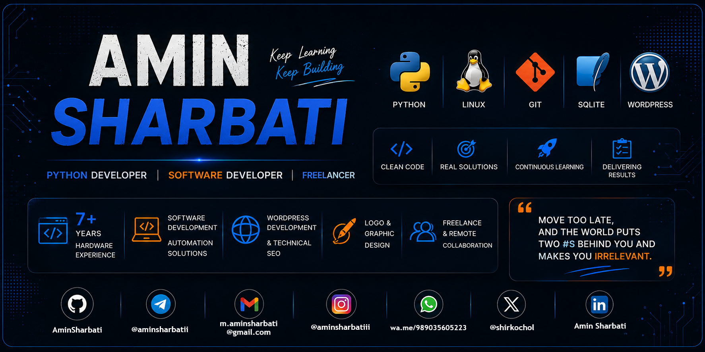

<!-- ========================================= -->
<!--                HEADER                      -->
<!-- ========================================= -->

<div align="center">



</div>

<div align="center">


</div>

# 🚀 About Me

```yaml
Name:
  Amin Sharbati

Roles:
  - Python Developer
  - Automation Engineer
  - Freelancer

Organization:
  Founder & Core Developer
  Dotin Aria Software Team

Experience:
  Hardware Specialist (7+ Years)

Location:
  Iran 💚🤍❤️
  Remote Worldwide 🌍
```

---

# 👨‍💻 whoami

```python
class AminSharbati:

    role = "Python Developer"

    organization = "Dotin Aria Software Team"

    focus = [
        "Automation",
        "Desktop Applications",
        "Clean Architecture",
        "Open Source"
    ]

    stack = [
        "Python",
        "SQLite",
        "SQLAlchemy",
        "Tkinter",
        "Linux"
    ]

    learning = [
        "Advanced Python",
        "Cyber Security",
        "Ethical Hacking"
    ]

    motto = "Build. Improve. Repeat."
```

---

# 🏢 Datin Aria Software Team

```yaml
Position:
  Founder & Core Developer

Mission:
  Building useful software solutions
  with clean architecture and modern technologies.

Focus:
  - Python Applications
  - Desktop Software
  - Automation Systems
  - Database Solutions
  - Open Source Projects
  - Website Design & Create
  - Wordpress Design
```

---

# ⚡ What I Love Building

```text
🐍 Python Automation

🖥 Desktop Applications

🌐 Websites & SEO Solutions

⚙ Productivity Tools

🗄 Database Driven Projects

🔒 Security & Ethical Hacking

🚀 Open Source Projects
```

---

# ⚒ Tech Stack

<div align="center">


</div>

---

# 🌌 My Journey

```text
2017 ⚙ Hardware Engineering

        ↓

2020 🌐 WordPress & SEO

        ↓

2022 🐍 Python Programming

        ↓

2024 🚀 Freelance Projects

        ↓

2025 🏢 Datin Aria Software Team

        ↓

∞ Continuous Learning
```

---

# 🚀 Current Focus

```yaml
Building:
  - Automation Tools
  - Desktop Applications
  - Open Source Projects

Learning:
  - Advanced Python
  - Ethical Hacking
  - Cyber Security

Working:
  - Freelance Projects
```

---

# 🧠 Philosophy

```python
while alive:

    learn()

    build()

    improve()

    repeat()
```

---

# ☕ Fun Facts

- 🐧 Linux Lover
- 🌙 Night Coder
- ⚡ Clean Code Enthusiast
- 🚀 Open Source Supporter
- 🔥 Always Learning Something New
- 🎯 Build First, Perfect Later

---

# 🏆 GitHub Trophies

<div align="center">


</div>

---

# 📊 GitHub Stats

<div align="center">


</div>

<div align="center">


</div>

---

# 📈 Contribution Graph

<div align="center">


</div>

---

# 🌱 Currently Learning

- 🐍 Advanced Python
- 🔒 Ethical Hacking
- 🛡 Cyber Security
- ⚙ Automation Engineering

---

# 🌐 Connect With Me

<div align="center">

<a href="https://t.me/aminsharbatii">

</a>

<a href="mailto:m.aminsharbati@gmail.com">

</a>

<a href="https://linkedin.com/in/Amin Sharbati">

</a>

<a href="https://instagram.com/aminsharbatiii">

</a>

</div>

---

<div align="center">

# ⚡ Quote

> **Build things that matter.**
>
> **Stay curious.**
>
> **Keep shipping. 🚀**

</div>

<!-- ===================================================== -->
<!--                    HERO BANNER                         -->
<!-- ===================================================== -->

<div align="center">


</div>

<div align="center">


</div>
